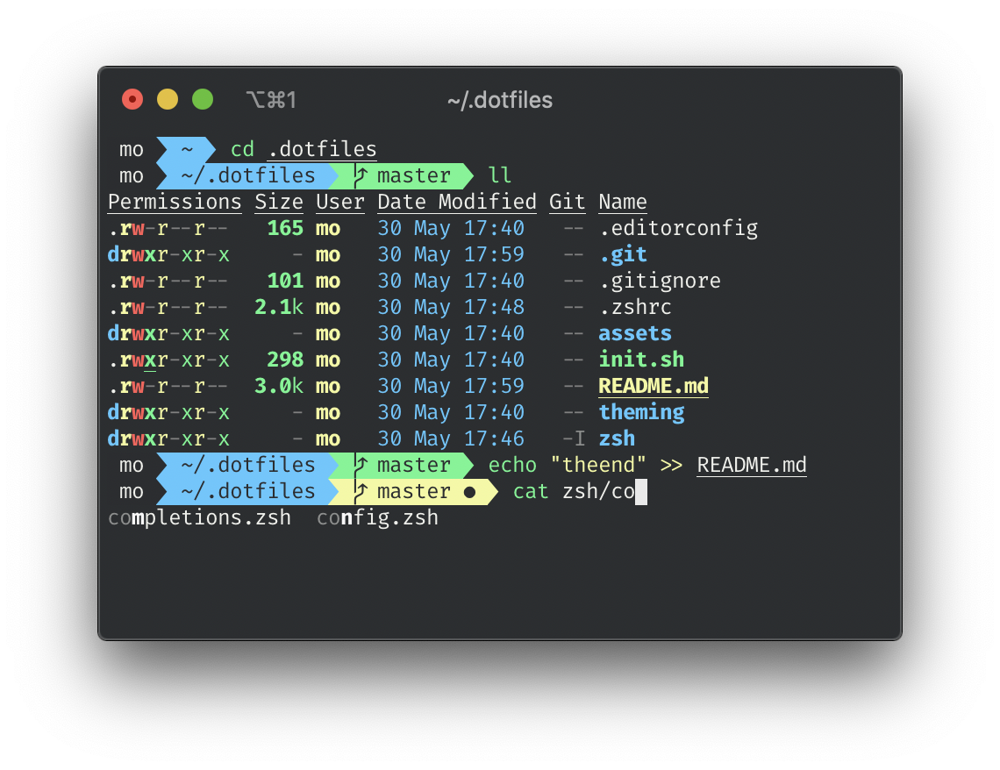

# `.dotfiles`

A collection of dotfiles and zsh config - mostly for Mac. Themed with bright colors and high contrasts for us sunny boys ☀️

## Background

Finally switched from fish to zsh and wanted to find a new home for my dotfiles and other configuration. Hope this makes it a breeze to setup my next machine. After a weekend of experimentation, my setup consists of:

- zsh, [`oh-my-zsh`](https://github.com/ohmyzsh/ohmyzsh) (one day without this bloat I hope), syntax-highlighting, and auto-suggestions.
- modified [Agnoster theme](https://github.com/agnoster/agnoster-zsh-theme)
- modified [Snazzy color profile](https://github.com/sindresorhus/iterm2-snazzy)
- various configs for VSCode, git, ssh, etc.
- a bunch of completions, aliases, functions, and environment variables

Thanks to all the makers for their open source work that I was allowed to build on top of.

## How to use

_Use at your own risk!_

The dotfiles are maintained as _my_ dotfiles. If you want to use them, update the configs (e.g. git+ssh configs, VSCode extensions, etc.) to your needs. Please backup your existing configuration.

*Step by step*:
1. Clone this repo into your home directory so that there is `~/.dotfiles`.
1. _Optional_: Revise and run `install.sh`. It takes care of installing tools.
1. Revise and run `sync.sh` It will update
   - zsh and relevant plugins
   - various symlinks and tools (git, ssh, vscode, etc.)
1. Create an iTerm2 profile (_Preferences > Profile_) and set it as default.
   - Go to the _Colors_ tab and import the color preset `theming/snazzy_mod.itermcolors`.
   - Go to the _Keys_ tab and select _Natural Text Editing_ under the _Presets..._ dropdown. This improves `zsh-autosuggestions` a lot as you can navigate through the suggestions and segments by (`⌥` +) arrow keys.
   - Go to the _Text_ tab and select the _FiraCode_ font (installed with `install.sh`). Enable ligatures.
   - Go to the _Terminal_ tab and enable _Unlimited scrollback_.
1. _Optional_: Update `zsh/nogit.example.zsh` to your needs. Delete `/assets`.
1. Source the zsh configuration by running `source ~/.zshrc`, or `reload` in case the aliases have been sourced already.

## Updates

1. `git pull` in the repo directory `~/.dotfiles`.
2. Run `sync.sh` to make sure that tools are up to date, symlinks exist, and all configs are in sync. If you don't use symlinks, you can diff the relevant files in your home directory (`.zshrc`, `.gitconfig`, and `.editorconfig`) and update them with the newly pulled files.

## Use for Linux

The scripts `install.sh` and `sync.sh` will install tools on Ubuntu. However, GUIs and fonts won't be installed. For details, please check both scripts and the CI job definition.

## TODO

- Switch to https://github.com/dandavison/delta when https://github.com/dandavison/delta/issues/177#issuecomment-635711834 is released
- benchmark performance
- Check Nix for install/sync script replacements
- introduce $TOOLS which resolves to user-owned dir where tools are installed. Or just use `/usr/bin`?
